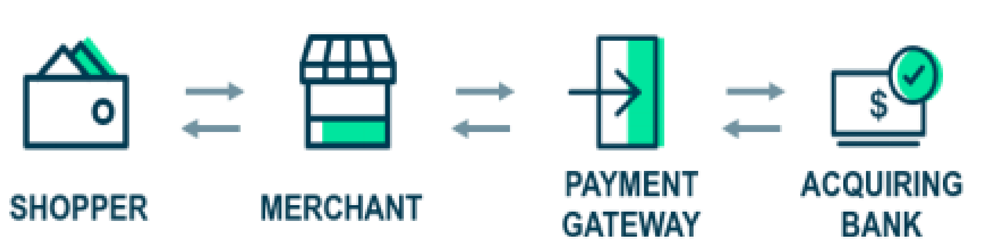

# Building a Payment Gateway

Original document: [checkout-building-a-payment-gateway.pdf](assets/checkout-building-a-payment-gateway.pdf)

## Background

E-Commerce is experiencing exponential growth and merchants who sell their goods or services online
need a way to easily collect money from their customers.

We would like to build a payment gateway, an API based application that will allow a merchant to offer a
way for their shoppers to pay for their product.

Processing a payment online involves multiple steps and entities:

1. **Shopper**: Individual who is buying the product online.
2. **Merchant**: The seller of the product. For example, Apple or Amazon.
3. **Payment Gateway**: Responsible for validating requests, storing card information and forwarding
   payment requests and accepting payment responses to and from the acquiring bank.
4. **Acquiring Bank**: Allows us to do the actual retrieval of money from the shopper’s card and payout
   to the merchant. It also performs some validation of the card information and then sends the
   payment details to the appropriate 3rd party organization for processing.
   
We will be building the payment gateway only and simulating the acquiring bank component in order to 
allow us to fully test the payment flow.

## Requirements
   
The product requirements for this initial phase are the following:
1. A merchant should be able to process a payment through the payment gateway and receive either
   a successful or unsuccessful response.
2. A merchant should be able to retrieve the details of a previously made payment. The next section will discuss each of these in more detail.
   
## Process a payment

The payment gateway will need to provide merchants with a way to process a payment. To do this, the 
merchant should be able to submit a request to the payment gateway. A payment request should include 
appropriate fields such as the card number, expiry month/date, amount, currency, and cvv.
   
### Simulating the bank
   
In your solution you should use the CKO bank simulator to simulate the Acquiring Bank (see diagram above).

## Retrieving a payment’s details

The second requirement for the payment gateway is to allow a merchant to retrieve details of a 
previously made payment using its identifier. Doing this will help the merchant with their reconciliation
and reporting needs. The response should include a masked card number and card details along with a
status code which indicates the result of the payment.
   
## Deliverables
1. Build an API that allows a merchant:
   a. To process a payment through your payment gateway.
   b. To retrieve details of a previously made payment.
2. Build a bank simulator to test your payment gateway API.
   
We support submissions in the following programming languages:
   - C#
   - Java
   - Javascript
   - Typescript
   - Python
   - Go
   
If you’d like to use any other language than the ones above please contact the recruiter first.
   
## Considerations
   
We’re conscious that home tests can take a long time to finish. We aim for candidates to spend 3 hours
on this test although it's up to you if you want to spend more time. When you submit your solution we’ll
review it and may ask you questions on it in subsequent chats.

Documentation is a key deliverable, spend time here as it lets us understand your thinking. Just some areas to consider:
   - How to run your solution.
   - Any assumptions you made.
   - Areas for improvement.
   - What cloud technologies you’d use and why.
   
## Extra mile bonus points

There are many ways to make your submission stand out, we don’t mark you down if you don’t have time
but if you want to show your skills go for it (just remember to point out what you did extra).
